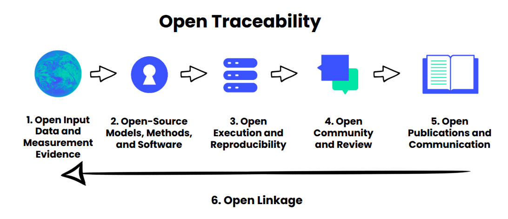

# Open Traceability Assessment

A Python command-line tool for running repeated **Open Traceability Assessments** against an open-source project, open-science project, report, dashboard, or other public sustainability-related evidence artifact.

The tool uses the OpenAI API and/or the Anthropic (Claude) API to assess how externally inspectable the evidence chain behind a project or claim is. It can run the same assessment multiple times, capture score variation across runs, preserve references used for scoring, show derivations for each score, and produce both structured JSON and a Markdown report. You can run against a single provider or against both at once to compare how different models score the same project.


<p align="center">
  
</p>

⚠️ This is a prototype that is still in development and currently relies heavily on LLM-only assessments. The implementation of a more structured, verifiable assessment using standardised data platforms is in development. In its current state, this tool requires a large number of tokens. The cost of a single assessment can be up to €1, depending on how many LLMs are run per assessment. Please also be aware of the significant energy and environmental impact that this can create on a large scale. We are currently trying to reduce token consumption. 

In its current state, this tool requires a large number of tokens. The cost of a single assessment can be as much as €1, depending on how many LLMs are run per assessment. Please also be aware of the significant energy and environmental impact this could have on a large scale. We are currently trying to reduce token consumption.⚠️

## Background

Rather than asking whether an environmental statement, insight, report or number is true or false, the Open Traceability Concept asks:

> How open, linked, and externally inspectable is the evidence chain behind a sustainability or environmental claim?

The concept is developed by the [Open Traceability Initiative](https://www.open-traceability-initiative.org/), which describes Open Traceability as the externally inspectable connection between an environmental claim and the specific evidence, methods, assumptions, and publications from which that claim was derived.

The project responds to a common weakness in sustainability decision-making: claims may be presented as evidence-based, but the chain linking evidence to the claim is often difficult to inspect. Data, models, assumptions, workflows, review processes, and publications may exist, but they are not always connected in ways that allow meaningful external scrutiny.

Open Traceability therefore shifts attention from openness of isolated artifacts to the inspectability of the **claim-support chain**. A dataset, repository, report, or paper may be public, but it is only traceable when the links between inputs, methods, execution, review, and outputs are explicit enough for others to examine.


## What this tool does

This repository provides a reusable assessment runner that:

- Fetches an Open Traceability definition and project evidence.
- Supports GitHub repositories, web pages, and PDF reports.
- Runs the assessment multiple independent times.
- Works with OpenAI models, Anthropic (Claude) models, or both providers in one run.
- Scores six Open Traceability dimensions from 0 to 100.
- Optionally computes an overall total score.
- Captures score derivations for every stage and run.
- Preserves references used by the model for each score and flags references that were not found in the collected evidence bundle.
- Writes results incrementally and stores every run in its own timestamped, project-named folder.
- Produces a structured JSON file for downstream analysis.
- Produces a Markdown report with tables, consolidated references, limitations, a per-model score comparison (when more than one model is used), and a single-paragraph summary.

The tool is intended as an assessment assistant. It does not prove that a claim is true, unbiased, or scientifically valid. Instead, it helps identify whether the evidence, assumptions, methods, limitations, uncertainty, and possible errors behind a claim can be inspected by others.

## The six Open Traceability dimensions

The assessment uses six dimensions derived from the Open Traceability definition.

### 1. Open Input Data and Measurement Evidence

Assesses whether the relevant inputs are identifiable, documented, attributable, reusable, verifiable, and versioned. Strong traceability means that external actors can inspect where the data came from, how it was collected or produced, how it was processed, what uncertainty or quality controls apply, and under what conditions it can be reused.

### 2. Open-Source Models, Methods, and Software

Assesses whether the analytical logic is visible through code, models, methods, dependencies, documentation, configuration, and licensing. Strong traceability normally requires version-controlled source code, clear methods, dependency information, and a recognized open-source license.

### 3. Open Execution and Reproducibility

Assesses whether workflows, scripts, parameters, computational environments, outputs, and provenance make the path from inputs to outputs inspectable. Strong execution traceability exists when an external actor can understand and, ideally, repeat the computation that produced the result.

### 4. Open Community and Review

Assesses whether critique, issue tracking, review, correction processes, and responses to challenge are visible. Strong review traceability means users can inspect not only the final claim, but also how it was questioned, tested, corrected, or improved.

### 5. Open Publications and Communication

Assesses whether reports, papers, dashboards, policy outputs, or explanatory materials are accessible and clearly documented. Strong publication traceability means public outputs state the claim clearly, describe the methods and evidence base, cite supporting artifacts, and preserve enough context for external scrutiny.

### 6. Open Linkage

Assesses whether the full chain across data, methods, execution, review, and publications is explicit, specific, versioned, and externally verifiable. This dimension is critical because openness without linkage does not produce traceability. Public artifacts are not enough if they cannot be connected to the claim they support.

## Assessment architecture

The broader Open Traceability framework proposes using open digital infrastructure to support assessment, including:

- [OpenAlex](https://openalex.org/) for publication-layer evidence, citation networks, open-access status, licensing signals, and correction or retraction markers.
- [ecosyste.ms](https://ecosyste.ms/) for software metadata, repository health, dependencies, licensing, maintenance, and governance signals.
- [OpenSustain.tech](https://opensustain.tech/) as a catalog of open sustainability technology.
- Large language models as assessment assistants that can identify candidate claims, surface relevant artifacts, classify evidence types, and summarize likely gaps for human review.

This runner implements the LLM-assisted part of that architecture. It collects a bounded evidence bundle and asks the model to produce structured, reference-backed assessments.

## Installation

This project can be run with [UV](https://docs.astral.sh/uv/), as all dependencies are specified in the header of the `open_traceability_assessment.py` file.

The provider SDKs are imported lazily, so you only need the one(s) you actually use: `openai` for `--provider openai`, `anthropic` for `--provider anthropic`, or both for `--provider both`.

## API keys

Provide an API key for each provider you intend to use. Create the key in the relevant platform, then expose it as an environment variable:

```bash
# Required for --provider openai (and --provider both)
export OPENAI_API_KEY="your_openai_api_key_here"

# Required for --provider anthropic (and --provider both)
export ANTHROPIC_API_KEY="your_anthropic_api_key_here"
```

The runner only checks for the keys it needs: `OPENAI_API_KEY` for OpenAI runs, `ANTHROPIC_API_KEY` for Anthropic runs, and both when `--provider both` is selected.

If you are assessing GitHub repositories and expect to fetch many files, you can also provide a GitHub token to reduce rate-limit issues:

```bash
export GITHUB_TOKEN="your_github_token_here"
```

## Usage

Run the assessment against the default example repository:

```bash
uv run open_traceability_assessment.py \
  --project-url https://github.com/natcap/invest \
  --runs 5 \
  --include-total \
  --out-prefix invest_open_traceability
```

Run the assessment against another project, report, or web page:

```bash
uv run open_traceability_assessment.py \
  --project-url https://example.org/report.pdf \
  --runs 3 \
  --include-total \
  --out-prefix example_report_traceability
```

Omit the overall total score while still scoring the six dimensions:

```bash
uv run open_traceability_assessment.py \
  --project-url https://github.com/natcap/invest \
  --runs 5 \
  --no-include-total
```

Use a different OpenAI model:

```bash
uv run open_traceability_assessment.py \
  --project-url https://github.com/natcap/invest \
  --runs 3 \
  --openai-model gpt-5.5 \
  --reasoning-effort medium
```

Assess with Anthropic (Claude) instead of OpenAI:

```bash
uv run open_traceability_assessment.py \
  --project-url https://github.com/natcap/invest \
  --runs 3 \
  --provider anthropic \
  --anthropic-model claude-opus-4-8
```

Assess with both providers at once and compare them in one report:

```bash
uv run open_traceability_assessment.py \
  --project-url https://github.com/natcap/invest \
  --runs 3 \
  --provider both \
  --openai-model gpt-5.5 \
  --anthropic-model claude-opus-4-8
```

With `--provider both`, `--runs` applies to each provider, so the example above produces 6 runs in total (3 per model). The report then includes an "Average score by model" table comparing the two.

### Model and reasoning options

| Option | Default | Description |
| --- | --- | --- |
| `--provider` | `openai` | Which provider(s) to assess with: `openai`, `anthropic`, or `both`. |
| `--model` | `gpt-5.5` | OpenAI model id (used for `openai` and `both`). |
| `--anthropic-model` | `claude-opus-4-8` | Anthropic (Claude) model id (used for `anthropic` and `both`). |
| `--reasoning-effort` | `medium` | `none`, `low`, `medium`, `high`, or `xhigh`. For OpenAI this maps to the reasoning parameter; for Anthropic it maps to adaptive thinking plus the effort parameter. Use `none` to disable. |
| `--runs` | `3` | Number of runs per selected provider. |
| `--output-dir` | `reports` | Base directory for the per-run output folder. |
| `--out-prefix` | `open_traceability_assessment` | Filename prefix for the JSON and Markdown outputs. |

## Token consumption and cost

> ⚠️ **Warning:** this tool sends a large evidence bundle to the model on every run, so it consumes a significant number of tokens. A default assessment can cost up to around **$1**, depending on the model and plan you use.

## Outputs

Each invocation writes its results into a dedicated folder named with a timestamp and the assessed project, under `--output-dir` (default `reports`). For example:

```text
reports/20260612-101648_invest_open_traceability/
├── invest_open_traceability.runs.json
└── invest_open_traceability.report.md
```

Results are written incrementally — the JSON is saved after every successful run — so a transient failure on a later run does not discard the runs that already completed.

The JSON output is an object with a top-level `human_review` flag (`approved`, starting `false`, plus reviewer instructions) and a `runs` array. A human reviewer validates all claims against the references provided and sets `approved` to `true`. Each entry in `runs` contains the full structured assessment data for that run, including:

- Run number.
- Project name and URL.
- The model that produced the run.
- Six stage scores.
- Score derivations.
- Evidence references.
- Uncertainty level (low/medium/high) and a one-line reason.
- Optional total score.
- Per-run summary paragraph.
- Limitations.

The Markdown report summarizes across runs rather than repeating each run verbatim, and contains:

- A human-reviewer approval checkbox at the top, to be checked once all claims have been validated against the references provided.
- The provider model(s) used, with the run numbers each produced.
- A final single-paragraph summary.
- A score table across runs, with average and standard deviation by dimension.
- An "Average score by model" comparison table (only when more than one model is used).
- An optional total score table.
- Consolidated references by stage, deduplicated across runs, with the modal reported uncertainty and a ⚠️ marker on any reference whose URL was not part of the collected evidence bundle.
- Consolidated, deduplicated limitations across runs.

## Scoring guidance

The default scoring scale is:

| Score range | Interpretation |
| --- | --- |
| 0-20 | Little or no public evidence for this dimension |
| 21-40 | Partial, fragmentary, or hard-to-verify evidence |
| 41-60 | Moderate evidence, but important gaps remain |
| 61-80 | Strong public evidence with some limitations |
| 81-100 | Excellent, explicit, versioned, reusable, externally verifiable evidence chain |

Scores should be interpreted as evidence-bundle-based traceability estimates, not as a definitive judgment of scientific truth or project quality.

## Recommended workflow

1. Select a bounded project, report, dashboard, or claim.
2. Run the assessment with at least three independent runs.
3. Inspect the references and derivations, not only the scores.
4. Identify where missing links reduce traceability.
5. Manually validate important findings before publication or decision use.
6. Use the report as a draft traceability profile, not as a final audit.

## Example use cases

Open Traceability can be applied to:

- Open-source sustainability software.
- Scientific reports and assessment outputs.
- Environmental dashboards.
- Climate and energy policy evidence.
- Sustainability claims in journalism.
- Monitoring systems based on geospatial or operational data.
- Research outputs that have been corrected, retracted, or contested.

## Limitations

This tool has important limitations:

- It depends on the evidence it can fetch or is given.
- It may miss relevant artifacts that are not linked from the target URL.
- It cannot independently verify every scientific or technical claim.
- It may over- or under-score dimensions where evidence is ambiguous.
- It should be paired with human review, especially for policy-relevant or high-stakes assessments.
- Repeated runs expose variation, but they do not eliminate model uncertainty.

## Related resources

- [Open Traceability Initiative](https://www.open-traceability-initiative.org/)
- [Open Traceability Definition](https://raw.githubusercontent.com/protontypes/open-traceability/refs/heads/main/docs/definition.md)
- [Technical Foundation: Open Traceability for Sustainability Claims](https://hackmd.io/FQrXd1sbSbyXeSp7vqQSHQ)
- [OpenAlex](https://openalex.org/)
- [ecosyste.ms](https://ecosyste.ms/)
- [OpenSustain.tech](https://opensustain.tech/)

